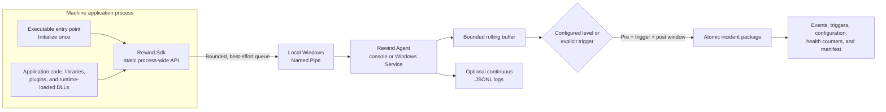
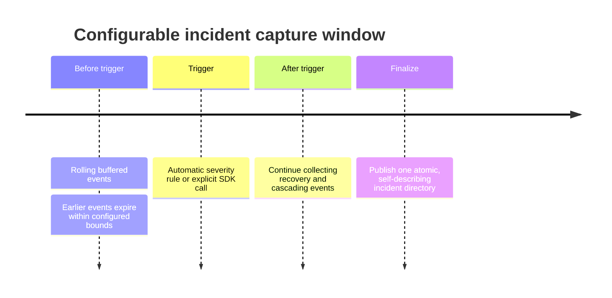

# Rewind

**A local-first incident flight recorder for Windows machine software.**

Rewind helps answer the question that appears after an intermittent machine
failure:

> What happened in the seconds before the incident?

Applications continuously send lightweight diagnostic events to a separate
Rewind Agent. The Agent retains a bounded rolling history and, when a configured
event or explicit trigger occurs, writes a complete incident package containing
the events before, during, and after the failure.

It is designed for industrial and long-running Windows applications where
diagnostic logging must never become more important than the machine itself.

## Why Rewind?

Traditional logs are useful when you already know what to log. Intermittent
machine failures are harder: the important evidence often happened seconds
before the visible error, while writing everything forever creates noise and
unbounded storage.

Rewind provides:

- **Evidence from before the failure** through a bounded rolling event buffer.
- **Automatic incident capture** when selected log levels occur.
- **Manual incident capture** when application logic detects a meaningful fault.
- **Post-trigger context** so recovery attempts and cascading failures are
  preserved.
- **Continuous logs where needed**, independently configured per level.
- **Bounded queues, buffers, files, and storage quotas** for predictable resource
  use.
- **Failure isolation**: Agent downtime, disk problems, malformed clients, and
  overloaded queues do not stop the instrumented application.
- **Visible evidence gaps** through SDK health and loss counters.
- **Local-only operation** using same-machine Windows Named Pipes—no cloud
  account, database, or network endpoint is required.

## How it works



The application initializes the SDK once. Any code loaded into that process can
then call the static recorder without receiving or sharing a logger object.
SDK calls only enqueue local work; they never perform Agent or disk I/O on the
application thread.

## Core capabilities

### Application SDK

- Static, process-wide API initialized once by the executable.
- Usable from the main project, referenced projects, plugins, and runtime-loaded
  DLLs in the same process.
- Trace, Debug, Information, Warning, Error, and Critical levels.
- Shared process context such as machine ID, recipe, software version, or station.
- Explicit incident triggers.
- Bounded event and control queues.
- Reconnection when the Agent starts or restarts.
- Health snapshots, flush outcomes, and controlled shutdown.
- Targets .NET Framework 4.6.2 and .NET Standard 2.0.

### Rewind Agent

- Headless .NET 10 application for Windows x64.
- Runs interactively for development or as an automatically started Windows
  Service for production.
- Per-level policy for buffering, continuous persistence, incident triggering,
  and incident inclusion.
- Configurable pre-trigger and post-trigger capture windows.
- Deterministic multi-client ingestion.
- Trigger merging within a bounded incident duration.
- Atomic incident publication with the manifest written last.
- Recovery quarantine for incomplete staging directories.
- Size rotation and count/byte quotas for continuous logs.
- Count/byte quotas for completed incident storage.
- Startup-validated JSON configuration with a supplied JSON Schema.

## Incident timeline



## Quick start

### 1. Install the SDK

```powershell
dotnet add package Rewind.Sdk --version 0.1.0
```

For a .NET Framework project using Visual Studio Package Manager Console:

```powershell
Install-Package Rewind.Sdk -Version 0.1.0
```

Installing `Rewind.Sdk` automatically resolves the matching
`Rewind.Protocol` and `Rewind.Abstractions` packages.

### 2. Initialize once

Call `Initialize` from the executable entry point:

```csharp
using Rewind.Sdk;

RewindRecorder.Initialize(new RewindOptions
{
    AgentPipeName = "Rewind.Agent",
    EventQueueCapacity = 4096,
    ControlQueueCapacity = 64
});

RewindRecorder.SetContext("MachineId", "MACHINE-01");
RewindRecorder.SetContext("SoftwareVersion", "2.4.7");
```

Any code in the process can now emit events:

```csharp
RewindRecorder.Information("Machine", "CycleCompleted", "Cycle=1842");
RewindRecorder.Warning("Vision", "LowConfidence", "Score=0.71");
RewindRecorder.Error("Motion", "MoveFailed", "Axis=X;Reason=Timeout");

RewindRecorder.TriggerIncident(
    "InitializationFailed",
    "Machine could not enter Ready state");
```

### 3. Run the Agent

The Agent will be distributed as a self-contained Windows x64 ZIP through GitHub
Releases. Public Agent executables are unsigned until trusted Authenticode
signing becomes available. Verify the release checksum before running downloaded
files.

```powershell
Rewind.Agent.Host.exe --config C:\ProgramData\Rewind\rewind-agent.json
```

The Agent reads configuration once at startup. Restart the console process or
Windows Service after changing the file.

Start with the [complete user guide](docs/user-guide.md), then see the
[SDK integration guide](docs/sdk-integration.md) and
[Agent configuration reference](docs/configuration.md).

## Try the complete flow from source

Open two terminals at the repository root.

Terminal 1:

```powershell
dotnet run --project src/Rewind.Agent.Host -- --config samples/Rewind.Sample.Playground/rewind-agent.playground.json
```

Terminal 2:

```powershell
dotnet run --project samples/Rewind.Sample.Playground
```

The sample initializes Rewind in the executable, emits events from a separate
component DLL, triggers an incident, and shows where the Agent stored the
evidence. See the [playground guide](samples/Rewind.Sample.Playground/README.md).

## What an incident contains

```text
data/
  incidents/
    <incident-id>/
      manifest.json
      events.jsonl
      triggers.json
      configuration.json
      recorder-health.json
```

The package records the captured events and triggers together with the effective
Agent configuration and SDK health counters. An incident is complete only when
`manifest.json` exists and reports `"status": "complete"`.

## Run automatically as a Windows Service

After interactive testing, install the Agent from an elevated PowerShell:

```powershell
.\scripts\install-service.ps1 `
  -AgentExecutable "C:\Program Files\Rewind\Rewind.Agent.Host.exe" `
  -ConfigurationFile "C:\ProgramData\Rewind\rewind-agent.json" `
  -Credential (Get-Credential)

Start-Service RewindAgent
```

The service uses automatic startup. Run `Restart-Service RewindAgent` after
changing configuration. The current alpha requires the Agent and instrumented
applications to run under the same Windows identity.

See the [Windows Service guide](docs/windows-service.md) for installation,
permissions, upgrades, troubleshooting, and removal.

## Build and verify

The repository uses the .NET SDK selected by `global.json`.

```powershell
dotnet restore Rewind.slnx
dotnet build Rewind.slnx --configuration Release --no-restore
dotnet run --project tests/Rewind.Tests --configuration Release --no-build
```

The executable verification suite covers bounded queues and buffers, Agent
absence and reconnection, multi-client ordering, automatic and explicit triggers,
atomic incident output, quota enforcement, malformed input isolation, storage
failures, staging recovery, configuration validation, flush behavior, and Unicode
payload round trips.

## Design boundaries

- SDK delivery is bounded, best-effort, and at-most-once.
- Rewind records caller-prepared strings and metadata; applications remain
  responsible for removing secrets and personal data.
- Transport is same-machine Windows Named Pipes only.
- Configuration reload requires an Agent process or service restart.
- Rewind is diagnostic evidence, not an audit log or guaranteed transactional
  event store.
- Version `0.1.x` is the initial public release line. Representative industrial
  host qualification and a production support commitment are not yet available.

Read [known limitations](docs/known-limitations.md) and
[platform support](docs/platform-support.md) before production evaluation.

## Documentation

- [Complete user guide](docs/user-guide.md)
- [SDK integration](docs/sdk-integration.md)
- [Agent configuration](docs/configuration.md)
- [Windows Service operation](docs/windows-service.md)
- [Troubleshooting](docs/troubleshooting.md)
- [Build from source](docs/build-from-source.md)
- [Incident format](docs/incident-format.md)
- [Resource bounds](docs/resource-bounds.md)
- [Distribution and releases](docs/distribution.md)
- [Known limitations](docs/known-limitations.md)

## License

Rewind is licensed under the [Apache License 2.0](LICENSE).
